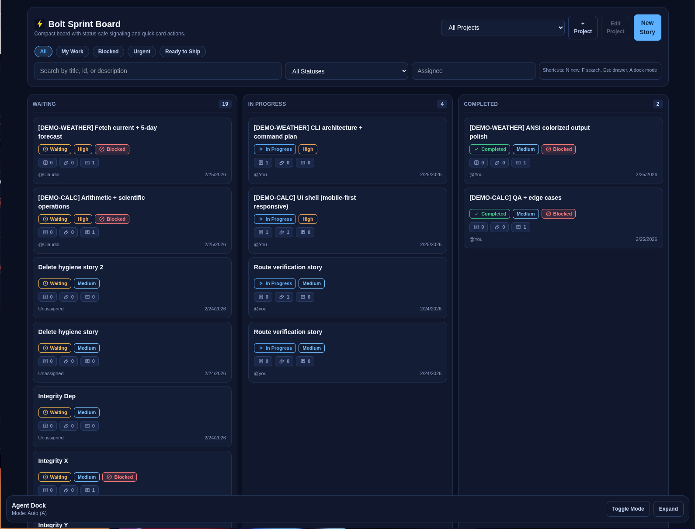

<div align="center">
  

# ⚡ Bolt
### Collaborative software development platform built as an interface between AI coding tools and the user. 

Bolt is a purpose-built workspace for running software sprints with an AI teammate — planning, execution, context, and visibility in one place.

[](https://github.com/ndhill84/bolt)
[](https://github.com/openclaw/openclaw)
[](https://github.com/ndhill84/bolt)
[](https://vitejs.dev/)
[](https://fastify.dev/)
[](https://www.postgresql.org/)
[](https://aws.amazon.com/s3/)

</div>
---

<div align="center">
  
</div>
---

## What Bolt is

**WARNING: project is in active development**

**Bolt is a collaborative software development tool designed specifically for you + OpenClaw to build projects together.**

It combines sprint planning, execution tracking, project context, and AI activity visibility so both the human and the agent can stay aligned and ship faster.

If a normal sprint board answers “what tasks exist,” Bolt also answers:
- **What is the AI working on right now?**
- **What changed this hour?**
- **What is blocked and why?**
- **What context/documents are attached to this work?**

---

## Core capabilities

### 1) Sprint management (visual)
- Kanban workflow: **Waiting → In Progress → Completed**
- Story editing with priority, assignee, points, due date, acceptance criteria
- Dependencies and blocker tracking
- Story notes and decision capture

### 2) Visual task monitoring (AI + team transparency)
- Live **Agent Activity** panel (current task + status)
- Timeline of agent actions and milestones
- Explicit blocker state (“waiting on user input”)
- Evidence links (commits, PRs, logs, tests)

### 3) Context management for better AI collaboration
- Attach files/docs/screenshots/logs to stories or project scope
- Keep context near the work item
- Support compact summaries for token-efficient AI usage

### 4) Token-efficient API design
- Compact list payloads
- On-demand detail fetches
- Delta sync (`updated_since`)
- Digest endpoints for concise sprint summaries

---

## Why this exists

Bolt exists to make **human + AI software development operationally real** — not just chat-based.

It gives both sides:
- shared execution truth,
- shared context,
- shared visibility,
- and a repeatable sprint loop that scales to bigger projects.

---


## 🧠 Token-Optimized API (AI-First by Design)

Bolt is built **ground-up for AI-assisted software development** — not retrofitted later.

That means the API is engineered to deliver maximum capability with minimal token burn, so OpenClaw and other agents can operate faster, cheaper, and with less context thrash.

### Why this matters
When AI teammates repeatedly parse oversized payloads, costs rise and performance drops. Bolt avoids that by making small, composable responses the default.

### Core token-reduction strategies

- **Thin lists, rich details**
  - List endpoints return compact cards only.
  - Full payloads are fetched on demand from detail routes.

- **Field projection (`fields=`)**
  - Ask only for what you need:
  - `?fields=id,title,status,priority,blocked`

- **Controlled expansions (`include=`)**
  - Nested data is opt-in, never automatic.
  - Prevents accidental response bloat.

- **Delta sync (`updated_since`)**
  - Agents ingest only changes, not full snapshots.
  - Perfect for continuous background collaboration.

- **Cursor pagination everywhere**
  - Predictable small pages with stable ordering.
  - Better for incremental AI loops.

- **Digest endpoints for AI reasoning**
  - Pre-computed summaries: counts, blockers, risks, next actions.
  - Dramatically reduces prompt size for planning/status turns.

- **Compact, stable schemas**
  - Consistent keys + enum values reduce parse errors and extra clarification turns.

- **Batch operations**
  - Move/update multiple stories in one request to reduce call overhead.

### Net result
Bolt gives you full sprint-management power **without** the token tax of bloated APIs.

It’s the same feature depth — just sharper, leaner, and built for human + AI execution velocity.

---

## Tech stack

- **Frontend:** React + TypeScript + Vite
- **Backend:** Fastify + TypeScript
- **Data:** PostgreSQL + Prisma
- **File storage:** S3-compatible object storage (MinIO/S3/R2)
- **Repo:** npm workspaces monorepo

---

## Repository structure

```text
bolt/
├─ apps/
│  ├─ web/          # React UI
│  └─ api/          # Fastify API
├─ packages/
│  └─ shared/       # Shared contracts/types
├─ docs/            # Architecture, API, product, phased plan
├─ assets/          # Branding assets (logo, etc.)
└─ docker-compose.yml
```

---

## Local setup

### Prerequisites
- Node.js 22+
- npm 10+
- Docker + Docker Compose

### Install + run

```bash
git clone https://github.com/ndhill84/bolt.git
cd bolt
npm install
docker compose up -d
```

Run services:

```bash
# Terminal A
npm run dev:api

# Terminal B
npm run dev:web
```

Defaults:
- API: `http://localhost:4000`
- Web: `http://localhost:5173`
- Postgres: `localhost:5432`
- MinIO API: `localhost:9000`
- MinIO Console: `localhost:9001`

---

## Build

```bash
npm run -ws build
```

---

## Project documentation

See `/docs` for:
- Product vision
- MVP scope
- System architecture
- Data model
- API spec
- UI/UX plan
- Build phases

---

## Current build status

In active development with core foundation already in place.

Implemented so far:
- Monorepo scaffold (web + api + shared)
- Initial sprint board workflow
- Story endpoints (list/create/edit/move)
- Notes support
- Architecture and phased planning docs

In progress:
- File upload/context pipeline
- Agent Activity UI module
- Dependency management UI
- Sprint digest endpoints

---

## Contributing philosophy

Prioritize:
1. Clear UX for collaboration
2. Token-efficient backend contracts
3. Observable AI work (no black boxes)
4. Fast iteration with small, shippable milestones

---

## License

TBD (set before public launch)
